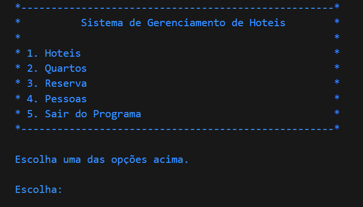

# Sistema de Gerenciamento de Hotéis OOP

## Descrição

Este projeto é uma aplicação em Java desenvolvida para gerenciar hotéis, seus quartos, clientes e funcionários. Ele oferece funcionalidades como:

- Adicionar, remover e listar hotéis.
- Gerenciar quartos em cada hotel, incluindo adição, remoção e listagem.
- Cadastro e gerenciamento de clientes e funcionários.
- Criação e gerenciamento de reservas de quartos.
- Listagem de todas as reservas feitas.

## Funcionalidades

### Hotéis

- **Adicionar Hotéis**: Permite a inclusão de novos hotéis no sistema.
- **Remover Hotéis**: Opção para remover hotéis existentes.
- **Listar Hotéis**: Exibe uma lista de todos os hotéis cadastrados no sistema.

### Quartos

- **Adicionar Quartos**: Possibilidade de adicionar quartos aos hotéis existentes.
- **Remover Quartos**: Permite a exclusão de quartos de um hotel.
- **Listar Quartos**: Lista todos os quartos disponíveis em cada hotel.

### Pessoas

- **Adicionar Clientes**: Cadastra novos clientes no sistema.
- **Adicionar Funcionários**: Cadastra novos funcionários para os hotéis.

### Reservas

- **Criar Reservas**: Permite a criação de reservas de quartos por clientes.
- **Listar Reservas**: Exibe todas as reservas feitas no sistema.

## Tecnologias Utilizadas

- **Linguagem**: Java
- **Banco de Dados**: PostgreSQL

## Membros da Equipe

<table>
  <tr>
    <td align="center">
      <a href="https://github.com/gustavoataidez">
         
        
          <b>Gustavo Ataidez</b>
        
      </a>
    </td>
     <td align="center">
      <a href="https://github.com/Adenilson666">
         
        
          <b>Adenilson Silva</b>
        
      </a>
    </td>
    <td align="center">
      <a href="https://github.com/farias-alan">
         
        
          <b>Alan Farias</b>
        
      </a>
    </td>
    <td align="center">
      <a href="https://github.com/caymiferreira">
         
        
          <b>Caymi Ferreira</b>
        
      </a>
    </td>
    <td align="center">
      <a href="https://github.com/KauLeal">
         
        
          <b>Kaú Leal</b>
        
      </a>
    </td>
    <td align="center">
      <a href="https://github.com/jobervalmagalhaes">
         
        
          <b>Joberval Magalhães</b>
        
      </a>
    </td>
  </tr>
</table>
